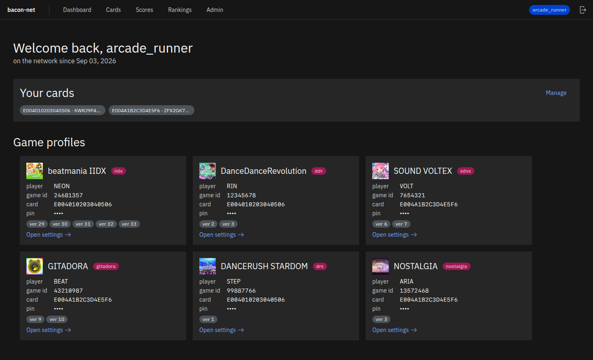

# bacon-net

Experimental e-amusement server intended for testing hacks, also usable by
players — an Elixir rewrite of [MonkeyBusiness](https://github.com/drmext/MonkeyBusiness).



Monorepo layout:

- `/` — Elixir server (Bandit/Plug, no Phoenix); game protocol, JSON APIs,
  TinyDB-compatible store
- `frontend/` — pure static webui (Vite + React +
  [Carbon](https://react.carbondesignsystem.com/)) for browsing and editing
  user data, served by the server under `/webui`

All binary dependencies (Elixir, Erlang/OTP, Node.js/npm, mix/hex tooling)
are managed by [Nix](https://nixos.org/) via the included flake; only a
working `nix` command is required.

## Usage

Development server (hot toolchain, port 8000):

```sh
nix develop
mix run --no-halt
```

or without entering the shell:

```sh
./start.sh
```

Release build (fully Nix-managed, offline after first fetch; the webui in
`frontend/` is built and bundled in automatically):

```sh
nix build
./result/bin/bacon_net start
```

The release root in `/nix/store` is read-only, so runtime state (run_erl
pipes/logs) goes to `/tmp/bacon_net` by default; override with
`RELEASE_TMP=/some/dir` if needed. The database is a `db.json` in the
directory you start the release from.

The built-in web interface for managing user data lives at
`http://localhost:8000/webui/` (see `frontend/README.md` for development).

## Configuration

Defaults match `config.py` from the Python project (see `config/config.exs`).
In releases, override via environment (`config/runtime.exs`):

| Variable                     | Default              |
| ---------------------------- | -------------------- |
| `BACON_PORT`                 | `8000`               |
| `BACON_IP`                   | auto-detected        |
| `BACON_ARCADE`               | `Ｍ０ＮＫＹＢＵＳ１Ｎ３Ｚ` |
| `BACON_PASELI`               | `10000`              |
| `BACON_VERBOSE_LOG`          | `1` (`0` disables)   |
| `BACON_RESPONSE_COMPRESSION` | `0` (`1` enables)    |
| `BACON_MAINTENANCE_MODE`     | `0` (`1` enables)    |
| `BACON_WEBUI_DIR`            | bundled webui        |
| `BACON_ADMIN_TOKEN`          | unset (API open)     |

The database is a TinyDB-compatible `db.json` in the working directory.

## Management API

Two JSON APIs back the webui:

**Player accounts (`/account/api`)** — used by the webui login screen.
Players register with username/password (PBKDF2-hashed, bearer-session
login), bind one or more e-amusement cards (UID or Konami ID; a card can
only be bound to one account), and then see only their own data: profiles
and settings per game (merge-patch editing; a profile's `card` can never be
reassigned through the API), their score history, and server-wide rankings.

**Operator API (`/manage/api`)** — generic CRUD over every DB table:

- `GET /manage/api/tables` — every DB table with document counts
- `GET /manage/api/cards` — all documents with a `card` field, grouped by card
- `GET /manage/api/table/{table}` / `POST` (insert)
- `GET /manage/api/table/{table}/{id}` / `PUT` (replace) / `PATCH` (merge) / `DELETE`
- `DELETE /manage/api/table/{table}` — drop a whole table
- `GET /manage/api/shops` / `POST` — list / add permitted shops (cabinet PCBIDs)
- `POST /manage/api/shops/{pcbid}/permit` / `.../revoke` — grant / revoke a shop's permission
- `DELETE /manage/api/shops/{pcbid}` — remove a shop entirely
- `GET /manage/api/users` — player accounts (credentials are never exposed)
- `POST /manage/api/users/{username}/ban` / `.../unban` — ban (kills live sessions) / unban

Documents are returned with their TinyDB id inlined as `_id`.

## Shops (PCBID permissions)

The server supports multiple shops, identified by the cabinet's PCBID (the
`srcid` attribute on every e-amusement request). A cabinet can only connect
when its PCBID is permitted:

- Game connections without a PCBID, or with an unknown/revoked PCBID, are
  rejected with a protocol-level error (`status="1"`).
- Unknown PCBIDs are remembered as *pending* shops (`shop` table,
  `"permitted": false`) so the operator can approve them from the Admin →
  Shops page (or `POST /manage/api/shops/{pcbid}/permit`).
- Shop documents predating this feature have no `permitted` field and count
  as permitted (grandfathered).
- Shops and player accounts are separate scopes: a shop permission only
  allows cabinets to connect, and players keep full access to their own
  cards regardless of which shop they played at.

### Production (arcade) deployment

The server has no TLS — run it on a trusted LAN or behind a reverse proxy.
Set `BACON_ADMIN_TOKEN` to protect `/manage/api` with
`Authorization: Bearer <token>` (players never need it; it is for the
operator's Admin view in the webui). When unset, `/manage/api` is open —
fine for development, not for a shop floor.

Permit each cabinet's PCBID from the Admin → Shops page before it can
connect (see "Shops (PCBID permissions)"). Use Admin → Users to ban a
player account; banned players cannot log in and their sessions are killed
immediately.

## Playable Games

- IIDX 18-20, 29-33 (Online Arena/BPL support)
- DDR A20P, A3, WORLD (OmniMIX/GF, BPL, and Fake PFREE support)
- GD 6-10 DELTA (Battle Mode support)
- DRS
- NOST 3
- SDVX 6-7

**Note**: Playable means settings/scores *should* save and load. Events are
not implemented.

## Tools (mix tasks)

- `mix mdb --input music_data.bin --output songs.json --extract`
  (`--create`, `--merge [--diff]`) — music_data.bin tool
- `mix import.iidx_automap --automap_xml X --version 30 --monkey_db db.json --iidx_id N`
- `mix import.ddr_automap --automap_xml X --version 3 --monkey_db db.json --ddr_id N`
- `mix db.trim [db.json]`

## Development

```sh
nix develop
mix test                              # unit tests (incl. kbinxml golden vectors)
mix run --no-halt                     # dev server
elixir -pa _build/dev/lib/bacon_net/ebin -pa _build/dev/lib/jason/ebin \
  scripts/smoke_test.exs              # end-to-end checks for all seven games
```

Frontend development (Node/npm come from the same `nix develop` shell):

```sh
cd frontend
npm install
npm run dev                           # vite dev server, proxies /manage + /config to :8000
npm run build                         # static build into frontend/dist
```

To serve a fresh frontend build from the dev server, copy it into place:
`cp -r frontend/dist/* priv/static/` (releases do this automatically).

`PORTING.md` documents the Python→Elixir architecture mapping for contributors.

## Troubleshooting

- DRS, GD, NOST, and SDVX require mdb xml files copied to the server folder
- **URL Slash 1 (On)** may be required in rare cases; **URL Slash 0 (Off)**
  in others (the server supports both, like the original)
- When initially creating a DDR profile, complete an entire credit without
  pfree hacks
