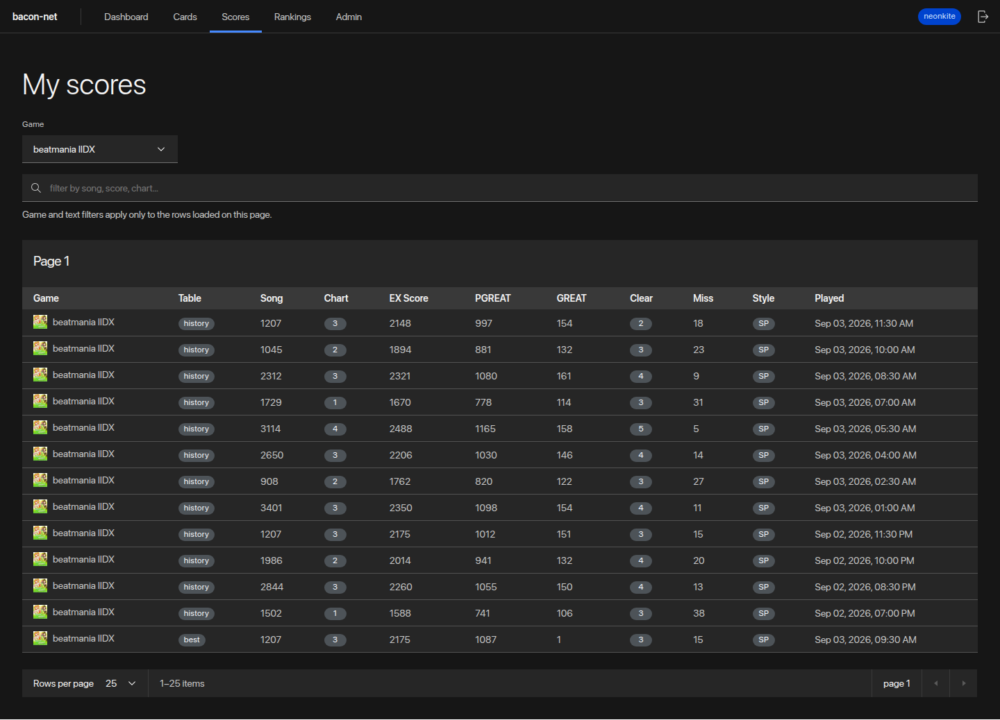
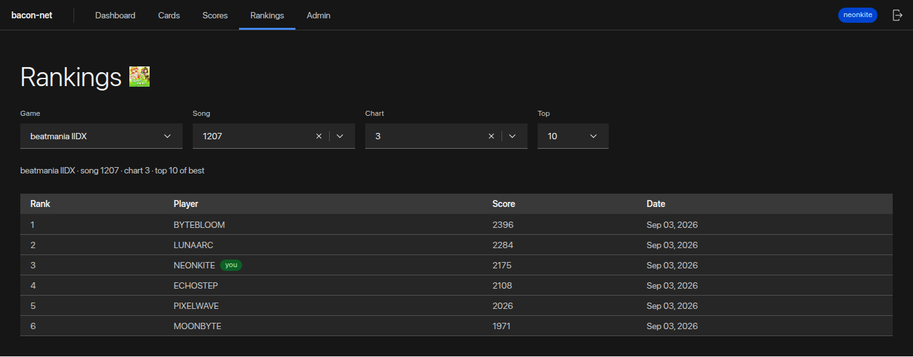
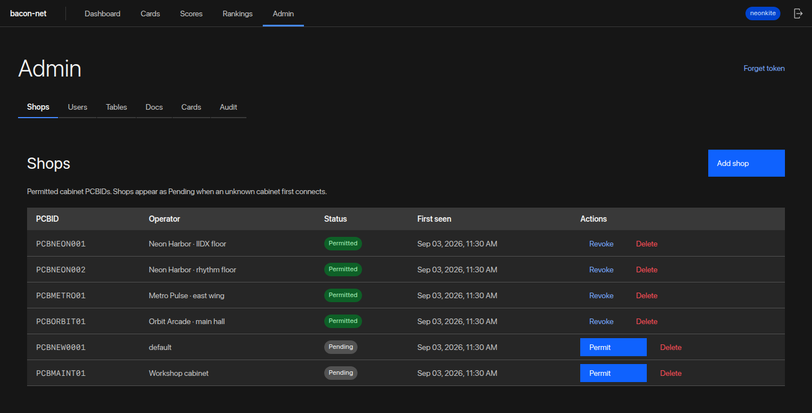
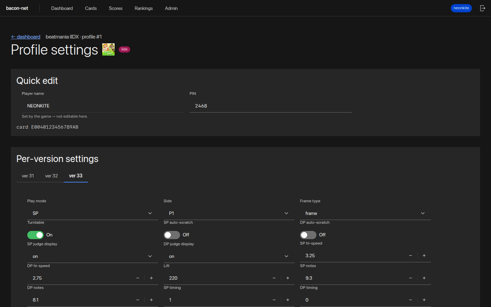

# bacon-net

An experimental multi-tenant e-amusement game service built with Elixir,
PostgreSQL, React, and Carbon.

bacon-net began as an Elixir rewrite of [MonkeyBusiness](https://github.com/drmext/MonkeyBusiness); it is now an independent project.

Monorepo layout:

- `/` — Elixir server (Bandit/Plug, no Phoenix); game protocol, JSON APIs,
  PostgreSQL-backed document store (Ecto)
- `frontend/` — pure static webui (Vite + React +
  [Carbon](https://react.carbondesignsystem.com/)) for browsing and editing
  user data, served by the server under `/webui`

## Web interface

The Carbon-based interface covers player self-service and operator workflows.
All identities, cards, scores, and shops shown below are synthetic. Select an
image to view it at full size.

<table>
  <tr>
    <td width="50%">
      <a href="docs/webui-dashboard.png"></a><br>
      <sub><strong>Player dashboard</strong> — bound cards and profiles across supported games.</sub>
    </td>
    <td width="50%">
      <a href="docs/webui-scores.png"></a><br>
      <sub><strong>Score history</strong> — game filtering, record details, and bounded pagination.</sub>
    </td>
  </tr>
  <tr>
    <td width="50%">
      <a href="docs/webui-rankings.png"></a><br>
      <sub><strong>Rankings</strong> — a chart leaderboard with the signed-in player highlighted.</sub>
    </td>
    <td width="50%">
      <a href="docs/webui-admin-shops.png"></a><br>
      <sub><strong>Operator console</strong> — permitted and pending cabinet workflows.</sub>
    </td>
  </tr>
  <tr>
    <td colspan="2">
      <a href="docs/webui-settings.png"></a><br>
      <sub><strong>Game settings</strong> — quick profile edits and curated per-version IIDX controls.</sub>
    </td>
  </tr>
</table>

All binary dependencies (Elixir, Erlang/OTP, Node.js/npm, PostgreSQL,
mix/hex tooling) are managed by [Nix](https://nixos.org/) via the included
flake; only a working `nix` command is required.

## Usage

Development server (hot toolchain, port 8000):

```sh
nix develop
mix run --no-halt
```

or without entering the shell:

```sh
./start.sh
```

Release build (fully Nix-managed, offline after first fetch; the webui in
`frontend/` is built and bundled in automatically):

```sh
nix build
./result/bin/bacon_net start
```

The release root in `/nix/store` is read-only, so runtime state (run_erl
pipes/logs) goes to `/tmp/bacon_net` by default; override with
`RELEASE_TMP=/some/dir` if needed.

## Database

All durable state lives in PostgreSQL. A write is acknowledged only after
the database commits; there is no in-memory authoritative copy.

- **Dev/test**: the server bootstraps a throwaway local cluster
  automatically (initdb/pg_ctl from the dev shell; data in
  `/tmp/bacon-net-pg-{dev,test}`) and runs migrations on boot.
- **Production**: set `DATABASE_URL=postgres://...` and run migrations
  explicitly before starting new nodes:

  ```sh
  ./result/bin/bacon_net eval "BaconNet.Release.migrate()"
  ```

- **Importing a legacy TinyDB `db.json`**:

  ```sh
  nix develop
  mix bacon_net.import_json path/to/db.json   # re-runnable; skips existing rows
  ```

- **Backups**: use `pg_dump` / WAL archiving from your PostgreSQL
  deployment; rehearse restores (`pg_restore` or PITR) regularly. The
  server itself keeps no state worth backing up.

The built-in web interface for managing user data lives at
`http://localhost:8000/webui/` (see `frontend/README.md` for development).

## Configuration

Defaults live in `config/config.exs`. In releases, override them through the
environment (`config/runtime.exs`):

| Variable                     | Default              |
| ---------------------------- | -------------------- |
| `DATABASE_URL`               | **required in prod** |
| `BACON_DB_POOL_SIZE`         | `10`                 |
| `BACON_PUBLIC_URL`           | `http://<ip>:<port>` |
| `BACON_PORT`                 | `8000`               |
| `BACON_IP`                   | auto-detected        |
| `BACON_ARCADE`               | `ＢＡＣＯＮ－ＮＥＴ`     |
| `BACON_PASELI`               | `10000`              |
| `BACON_VERBOSE_LOG`          | `1` (`0` disables)   |
| `BACON_RESPONSE_COMPRESSION` | `0` (`1` enables)    |
| `BACON_MAINTENANCE_MODE`     | `0` (`1` enables)    |
| `BACON_WEBUI_DIR`            | bundled webui        |
| `BACON_ADMIN_TOKEN`          | unset (API closed)   |
| `BACON_MAX_DECOMPRESSED_BODY` | `16000000`          |
| `BACON_CORS_ORIGINS`         | none (comma-separated allowlist) |
| `BACON_LEGACY_GAME_APIS`     | `0` (legacy per-game JSON APIs off) |
| `RELEASE_COOKIE`             | generated per build  |

Durable state lives in PostgreSQL (see "Database"); there is no `db.json`
anymore.

## Ops endpoints

- `GET /healthz` — liveness, always 200
- `GET /readyz` — 200 only when the database is reachable, else 503
- `GET /metrics` — Prometheus text (request/DB/decode/reject counters);
  requires the admin bearer token

Every request carries an `x-request-id` (honored if supplied, generated
otherwise) that appears in logs and the response headers.

## Management API

Two JSON APIs back the webui:

**Player accounts (`/account/api`)** — used by the webui login screen.
Players register with username/password (PBKDF2-hashed, bearer-session
login), bind one or more e-amusement cards (UID or Konami ID; a card can
only be bound to one account), and then see only their own data: profiles
and settings per game (merge-patch editing; a profile's `card` can never be
reassigned through the API), their score history, and server-wide rankings.

**Operator API (`/manage/api`)** — generic CRUD over document tables plus
cabinet lifecycle, user moderation, and an audit trail:

- `GET /manage/api/tables` — every DB table with document counts
- `GET /manage/api/cards` — all documents with a `card` field, grouped by card
- `GET /manage/api/table/{table}` / `POST` (insert)
- `GET /manage/api/table/{table}/{id}` / `PUT` (replace) / `PATCH` (merge) / `DELETE`
- `DELETE /manage/api/table/{table}` — drop a whole table
- `GET /manage/api/shops` / `POST` — list / add permitted shops (cabinet PCBIDs)
- `POST /manage/api/shops/{pcbid}/permit` / `.../revoke` — grant / revoke a shop's permission
- `DELETE /manage/api/shops/{pcbid}` — remove a shop entirely
- `GET /manage/api/users` — player accounts (credentials are never exposed)
- `POST /manage/api/users/{username}/ban` / `.../unban` — ban (kills live sessions) / unban
- `GET /manage/api/audit?limit=&cursor=` — paginated audit events for every
  admin mutation (actor, action, target, outcome, request id)

The credential-bearing tables (`webui_users`, `webui_sessions`) are refused
by the generic table routes; the curated endpoints above are the only
access. Every mutation is recorded in the audit trail.

Documents are returned with their TinyDB id inlined as `_id`.

## Shops (PCBID permissions)

The server supports multiple shops, identified by the cabinet's PCBID (the
`srcid` attribute on every e-amusement request). A cabinet can only connect
when its PCBID is permitted:

- Game connections without a PCBID, or with an unknown/pending/revoked
  PCBID, are rejected with a protocol-level error (`status="1"`).
- Unknown PCBIDs are remembered as *pending* cabinets so the operator can
  approve them from the Admin → Shops page (or
  `POST /manage/api/shops/{pcbid}/permit`).
- Cabinets live under shops, which live under networks (the tenancy
  schema); every request resolves its cabinet and carries a trusted
  `RequestContext` — the body-supplied PCBID selects the cabinet record
  but grants nothing by itself.
- Shops and player accounts are separate scopes: a shop permission only
  allows cabinets to connect, and players keep full access to their own
  cards regardless of which shop they played at.

### Production (arcade) deployment

The server has no TLS — run it on a trusted LAN or behind a reverse proxy.
Set `BACON_ADMIN_TOKEN` to protect `/manage/api` with
`Authorization: Bearer <token>` (players never need it; it is for the
operator's Admin view in the webui). When unset, `/manage/api` is closed
entirely (fail closed).

Permit each cabinet's PCBID from the Admin → Shops page before it can
connect (see "Shops (PCBID permissions)"). Use Admin → Users to ban a
player account; banned players cannot log in and their sessions are killed
immediately.

## Playable Games

- IIDX 18-20, 29-33 (Online Arena/BPL support)
- DDR A20P, A3, WORLD (OmniMIX/GF, BPL, and Fake PFREE support)
- GD 6-10 DELTA (Battle Mode support)
- DRS
- NOST 3
- SDVX 6-7

**Note**: Playable means settings/scores *should* save and load. Events are
not implemented.

## Tools (mix tasks)

- `mix mdb --input music_data.bin --output songs.json --extract`
  (`--create`, `--merge [--diff]`) — music_data.bin tool
- `mix bacon_net.import_json [db.json]` — import a TinyDB db.json into
  PostgreSQL (re-runnable)
- `mix import.iidx_automap --automap_xml X --version 30 --iidx_id N`
- `mix import.ddr_automap --automap_xml X --version 3 --ddr_id N`
- `mix db.trim`

## Development

```sh
nix develop
mix test                              # unit tests (incl. kbinxml golden vectors)
mix run --no-halt                     # dev server
elixir -pa _build/dev/lib/bacon_net/ebin -pa _build/dev/lib/jason/ebin \
  scripts/smoke_test.exs              # end-to-end checks for all seven games
```

Frontend development (Node/npm come from the same `nix develop` shell):

```sh
cd frontend
npm install
npm run dev                           # vite dev server, proxies /manage + /config to :8000
npm run build                         # static build into frontend/dist
```

### Refreshing the README screenshots

The tracked helpers recreate the gallery from isolated, synthetic data. In
one `nix develop` terminal, build and serve the fixture environment:

```sh
npm --prefix frontend run build
mix run --no-start scripts/readme_screenshot_server.exs
```

Then, with Chromium available on `PATH`, run from a second terminal:

```sh
node scripts/capture_readme_screenshots.mjs
```

Set `CHROMIUM_BIN` when the executable has another name. The fixture server
listens only on `127.0.0.1`, resets only its dedicated PostgreSQL database in
`/tmp/bacon-net-pg-readme-screenshots`, and never writes runtime data into the
repository. The capture script replaces the five tracked images under
`docs/` and also writes an untracked narrow-layout check to `/tmp`.

To serve a fresh frontend build from the dev server, copy it into place:
`cp -r frontend/dist/* priv/static/` (releases do this automatically).

## Troubleshooting

- DRS, GD, NOST, and SDVX require mdb xml files copied to the server folder
- **URL Slash 1 (On)** may be required in rare cases; **URL Slash 0 (Off)**
  in others; the server supports both modes
- When initially creating a DDR profile, complete an entire credit without
  pfree hacks
